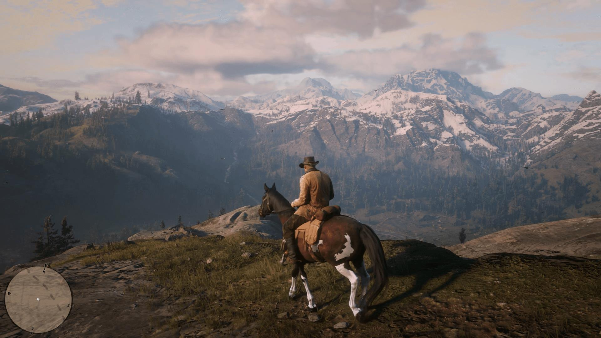
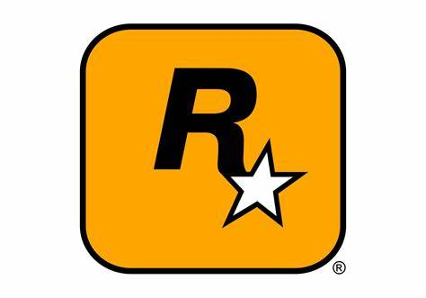

.. book documentation master file, created by
   sphinx-quickstart on Mon Nov  6 15:57:10 2023.
   You can adapt this file completely to your liking, but it should at least
   contain the root `toctree` directive.
============================================
Witaj na stronie o Red Dead Redemtion 2
============================================
Red Dead Redemption 2 to gra amerykanskiego studia Rockstar Games. Nastepca Red Dead Redemption tym razem trafil
tez na komputery osobiste, mimo ze pierwsza czesc byla dostepna tylko na konsolach.

.. toctree::
   :maxdepth: 2
   
Fabuła
=============================

Akcja Red Dead Redemption 2 przenosi nas do roku 1899, a glownym bohaterem jest niejaki Arthur Morgan. Kontrole nad protagonista przejmujemy po tym, jak gang Van der Linde ucieka z Blackwater po niezbyt udanym napadzie i smierci kilku jego członkow.

Uciekajac, gang zostawia za soba dosc spora sumke pieniedzy, a po przybyciu do swojego nowego obozu postanawia oczywiscie zrobic wszystko, aby przetrwac. Sytuacje niestety komplikuje fakt, iz świat dookola sie zmienia. Czasy dzikiego zachodu odchodza w niepamiec, a wraz z nimi rewolwerowcy oraz ich slynne napady na pociągi. Pojedynki o honor ustepuja miejsce kapitalizmowi.Niestety losy gangu takze w nowym obozie mocno sie komplikuja. Morgan oraz kilku innych członkow gangu napada na pociag nalezacy do niebywale bogatego i wplywowego czlowieka o imieniu Leviticus Cornwall. Najmuje on wowczas specjalnych agentow, ktorzy na czele Andrew Miltona, maja za zadanie pojmac wszystkich winnych.

W tym momencie sprawy zaczynaja sie rozkrecac, a z godziny na godzine glowny bohater Red Dead Redemption 2 ma coraz wiecej problemow.

Historia Arthura przed wydarzeniami z gry
============================================
Arthur to urodzony w 1863 roku syn Beatrice i Lyle’a Morganów. Jego matka zmarła młodo z nieznanych przyczyn, a ojciec był banitą i rewolwerowcem. W 1874 roku został aresztowany za kradzież, zginął niedługo potem na oczach syna, prawdopodobnie przez powieszenie. Arthur miał wtedy 14 lat.

Około 1877 roku Arthur został przygarnięty przez Dutcha Van der Linde i Hoseę Matthews’a. Wychowywany przez nich przyjął styl życia Dutcha polegającą na życiu poza prawem i z dala od cywilizacji. Arthur był jednym z pierwszych członków Gangu Van Der Linde.

Arthur w młodości poznał dziewczynę Mary Gilis. Młodzi byli w sobie głęboko zakochani, jednak jej rodzina nie akceptowała Arthura i jego stylu życia jako przestępcy wyrwanego spod prawa. Jedyną osobą z rodziny Mary która akceptowała Arthura był jej młodszy brat Jamie którego Arthur nauczył jazdy na koniu. Wkrótce ich związek się rozpadł a Mary ożeniła się z Barrym Lintonem.

W pewnym momencie Arthur w saloonie poznał młodą kelnerkę o imieniu Eliza. Doszło między nimi do zbliżenia co zaowocowało nieplanowaną ciążą. Arthur nie chciał składać obietnic których nie mógłby spełnić, ale zaproponował pomoc ze swojej strony. Kobieta wiedziała o jego stylu życia i to akceptowała. Wkrótce urodził się ich syn-Isaac. Arthur co kilka miesięcy odwiedzał rodzine i spędzał z nią kilka dni po czym ponownie wyruszył w dalszą drogę z gangiem. Kiedy pewnego dnia Arthur postanowił ponownie odwiedzić syna okazało się, że ich dom został spalony a w jego miejscu były wbite dwa drewniane krzyże. W późniejszym czasie odkrył, że zostali oni napadnięci przez włamywaczy którzy okradli i zabili kobietę wraz z chłopcem dla marnych dziesięciu dolarów. Arthur nigdy do końca nie pogodził się ze śmiercią syna i rzadko o nim wspominał.

.. image:: artur.jpg

Inne gry stworzone przez Rockstar:
===========================================
-GTA

-Earthworn Jim 3D

-Grand Theft Auto: London 1969

-Grand Theft Auto: London, 1961

-Grand Theft Auto 2

-Thrasher Presents Skate And Destroy

-Austin Powers: Oh Behave

-Austin Powers: Welcome to My Underground Lair!

-Wild Metal: Reclaim the Future

-Midnight Club: Street Racing

-Surfing H3O

-Smuggler's Run

-Smuggler's Run 2: Hostile Territory

-Oni

-Max Payne

-Grand Theft Auto III

-The Italian Job

-State of Emergency

-Smuggler's Run Warzones

-Grand Theft Auto: Vice City

-Midnight Club II

-Max Payne 2: The Fall of Max Payne

-Manhunt

-Red Dead Revolver

-Grand Theft Auto Advance

-Grand Theft Auto: San Andreas

-Midnight Club 3: DUB Edition

-The Warriors

-Grand Theft Auto: Liberty City Stories

-Midnight Club 3: DUB Edition Remix

-Rockstar Games Presents Table Tennis

-Bully

-Grand Theft Auto: Vice City Stories

-Manhunt 2

-Bully: Scholarship Edition

-Grand Theft Auto IV

-Midnight Club: Los Angeles

-Midnight Club: L.A. Remix

-Grand Theft Auto IV: The Lost and Damned

-Grand Theft Auto: Chinatown Wars

-Grand Theft Auto: The Ballad of Gay Tony

-Beaterator

-Manhunt 2

-Grand Theft Auto: Episodes from Liberty City

-Red Dead Redemption

-L.A. Noire

-Max Payne

-Max Payne 3

-Grand Theft Auto V

-Red Dead Redemption 2

-Grand Theft Auto: The Trilogy – The Definitive Edition

